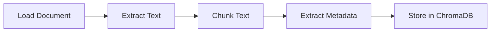
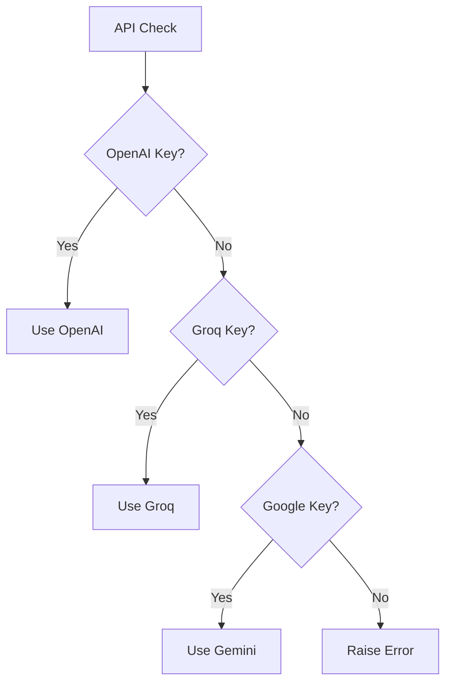

# 🤖 RAG Assistant — ChromaDB + LLM demo for document‑grounded QA

[](https://www.python.org/downloads/)
[](https://python.langchain.com/)
[](https://www.trychroma.com/)

A production-ready Retrieval-Augmented Generation (RAG) system that enhances Large Language Models with custom document knowledge. Built for AAIDC Project 1 Certification.

## ✨ Key Features

- 📚 **Multi-Format Support**: Process both PDF and TXT files
- 🔄 **Smart Text Processing**: Recursive chunking with overlap for better context
- 🎯 **Flexible LLM Integration**: 
  - OpenAI (GPT-4/3.5)
  - Groq (Llama)
  - Google (Gemini)
- 💾 **Persistent Storage**: ChromaDB with automatic metadata tracking
- 🤝 **Dual Chat Modes**: 
  - RAG-enhanced responses (document-based)
  - Direct LLM interaction (/chat command)
- � **Rich Console UI**: Color-coded responses and clear formatting

## 🚀 Quick Start

### Prerequisites

- Python 3.8 or higher
- One of these API keys:
  - [OpenAI API Key](https://platform.openai.com/api-keys)
  - [Groq API Key](https://console.groq.com/keys)
  - [Google AI Studio Key](https://aistudio.google.com/app/apikey)
- Virtual environment (recommended)

### Installation

```bash
# Clone the repository
git clone https://github.com/juvelanish/RAG-Assistant
cd ReadyTensorRAG

# Create and activate virtual environment
python -m venv venv
.\venv\Scripts\activate  # Windows
source venv/bin/activate # Linux/Mac

# Install dependencies
pip install -r requirements.txt
```

### Configuration

1. Copy the environment template and edit your API keys:
   ```powershell
   copy .env.example .env
   notepad .env  # or edit with your preferred editor
   ```

2. Minimum environment variables (see `.env.example`):
   ```env
   OPENAI_API_KEY=sk-...       # OpenAI (Preferred)
   OPENAI_MODEL=gpt-4o-mini    # Default used by the code
   GROQ_API_KEY=               # Groq (optional)
   GROQ_MODEL=llama-3.1-8b-instant
   GOOGLE_API_KEY=             # Google (optional)
   GOOGLE_MODEL=gemini-2.0-flash
   CHROMA_COLLECTION_NAME=rag_documents
   ```

### Adding Documents

Place your documents in the `data/` folder:
```
data/
├── document1.txt    # Text files
├── document2.txt
├── report.pdf      # PDF files
└── paper.pdf
```

### Running the Assistant

1. Start the system (PowerShell example):
   ```powershell
   python src/app.py
   ```

2. Expected startup (examples vary by provider):
   ```text
   Initializing RAG Assistant...
   Using OpenAI model: gpt-4o-mini
   Vector database initialized with collection: rag_documents
   RAG Assistant initialized successfully

   Loading documents...
   Loaded N sample documents
   ```

3. Use the interactive interface:

   **Document-Based Questions (RAG Mode)**
   ```
   Enter a question: What are the main challenges in quantum computing?
   AI: Based on the documents, the main challenges in quantum computing include:
   1. Maintaining quantum coherence
   2. Error correction in quantum systems
   3. Scaling up qubit systems while maintaining stability
   ...
   ```

   **General Knowledge (Chat Mode)**
   ```
   Enter a question: /chat How do neural networks work?
   AI: Neural networks are computational models inspired by biological neurons...
   ```

   **Commands**
   - Regular question: Searches documents and provides contextual answers
   - `/chat <question>`: Direct LLM interaction without document context
   - `quit`: Exit the application

### Step-by-step: from zero to first result

1. 

### Interactive Features

The assistant provides two powerful interaction modes:

1. **📚 RAG-Enhanced Mode** (Default)
   - Searches through your documents for relevant information
   - Combines document knowledge with LLM capabilities
   - Provides source-backed, contextual answers
   - Perfect for domain-specific questions

2. **💭 Direct Chat Mode** (`/chat`)
   - Bypasses document search for general questions
   - Uses LLM's built-in knowledge
   - Maintains conversation memory
   - Ideal for clarifications or general topics


## ⚙️ Architecture & Design

### 1. Document Processing Pipeline


- **Text Chunking**
  - Algorithm: RecursiveCharacterTextSplitter
  - Chunk size: 500 characters
  - Overlap: 20 characters
  - Ensures context preservation

- **Metadata Extraction**
  - File attributes (name, path, size)
  - Creation/modification times
  - PDF-specific: page numbers, document info

### 2. Vector Search Implementation


- **ChromaDB Configuration**
  - Default embedding model
  - Persistent storage enabled
  - Collection: "rag_documents"

### 3. LLM Integration


- **Provider Priority**
  1. OpenAI (GPT-4/3.5)
  2. Groq (Llama)
  3. Google (Gemini)

- **Configuration**
  - Temperature: 0 (consistent outputs)
  - Customizable models via env vars
  - Automatic fallback handling
## 🔧 Advanced Configuration

### Environment Variables

```env
# LLM Provider Selection
OPENAI_API_KEY=sk-...     # Primary provider
GROQ_API_KEY=gsk-...      # Secondary provider
GOOGLE_API_KEY=aist...    # Tertiary provider

# Model Selection
OPENAI_MODEL=gpt-4-turbo  # Default: gpt-4-mini
GROQ_MODEL=llama-3.1-8b   # Default: llama-3.1-8b-instant
GOOGLE_MODEL=gemini-pro   # Default: gemini-2.0-flash

# Vector DB Configuration
CHROMA_COLLECTION_NAME=custom_collection  # Default: rag_documents
```

### Customization Points

1. **Chunking Parameters** (`vectordb.py`)
   ```python
   def chunk_text(self, text: str, chunk_size: int = 500):
       text_splitter = RecursiveCharacterTextSplitter(
           chunk_size=chunk_size,    # Adjust for your needs
           chunk_overlap=20,         # Increase for better context
           length_function=len,
           is_separator_regex=False
       )
   ```

2. **Search Configuration** (`vectordb.py`)
   ```python
   def search(self, query: str, n_results: int = 5):
       results = self.collection.query(
           query_texts=[query],
           n_results=n_results  # Adjust for more/less context
       )
   ```

3. **LLM Parameters** (`app.py`)
   ```python
   # Adjust model parameters
   ChatOpenAI(
       model=model_name,
       temperature=0.0,  # Increase for more creative responses
   )
   ```

### Custom Document Types

To add support for new document types, extend `load_documents()` in `app.py`:

```python
elif ".docx" in docs.name:  # Example for Word docs
    doc = Document(r_path)
    content = "\n".join([p.text for p in doc.paragraphs])
    results.append({"content": content, "name": docs.name})
```

## 🧪 Testing & Validation

### Automated Tests

This repository does not include a `tests/` directory by default. See `docs/Evaluation.md` for guidance on creating evaluation scripts and test harnesses for retrieval metrics.

### Manual Testing Checklist

1. **Document Processing**
   - [ ] Load sample TXT files
   - [ ] Load sample PDF files
   - [ ] Try corrupted/empty files
   - [ ] Verify metadata extraction

2. **Search Functionality**
   - [ ] Simple keyword queries
   - [ ] Complex semantic queries
   - [ ] Edge cases (empty query, special chars)
   - [ ] Verify chunk relevance

3. **Chat Interactions**
   - [ ] RAG mode answers
   - [ ] Direct chat mode
   - [ ] Context retention
   - [ ] Error handling

## 📝 Troubleshooting

### Common Issues

1. **API Key Errors**
   ```
   ValueError: No valid API key found
   ```
   ➜ Check your `.env` file and ensure at least one API key is set

2. **Document Loading Fails**
   ```
   UnicodeDecodeError: 'utf-8' codec can't decode byte...
   ```
   ➜ Ensure text files are UTF-8 encoded

3. **ChromaDB Errors**
   ```
   ChromaDBError: Collection not found
   ```
   ➜ Delete `./chroma_db` and restart

### Performance Tips

1. **Memory Usage**
   - Reduce chunk size for large documents
   - Use streaming responses for long outputs
   - Clear ChromaDB collection periodically

2. **Search Quality**
   - Increase chunk overlap for better context
   - Adjust n_results based on document size
   - Use specific queries for better matches

3. **Response Speed**
   - Use Groq for faster responses
   - Enable persistent storage
   - Optimize document chunk size

   ## 📜 License

   This repository includes a `LICENSE` file in the project root. Please review it for the full legal terms. In short: this project is provided for research and educational purposes; follow the license terms before reusing the code or distributing derivatives.

   ## 📚 Additional Documentation

   In addition to this README, the repository includes focused docs for evaluation, embeddings, and safety:
   - `docs/Evaluation.md` — retrieval metrics and evaluation workflow
   - `docs/Embeddings.md` — guidance on embedding model choices and tradeoffs
   - `docs/Safety.md` — safety, PII handling, and operational guardrails

